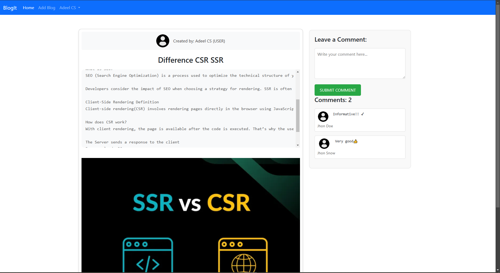
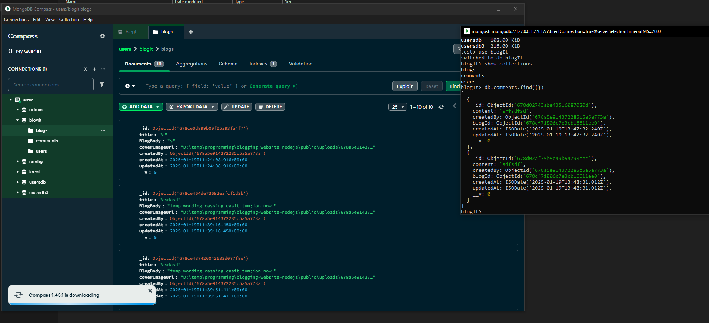

# Blogging Website (Server-Side Rendering)

This is a blogging website built using **Express**, **Mongoose**, **EJS**, and **Bootstrap**. It uses **server-side rendering (SSR)** to dynamically generate HTML pages based on data from a MongoDB database.


## Screenshots

### Homepage


### Add Blog Page


### Blog Page


### SignUp/In Section


### MongoDb Connection



## Features

- **Server-Side Rendering (SSR)**: EJS templating engine dynamically renders content on the server.
- **Authentication**: Only authenticated users can post comments, while everyone can view blogs and comments.
- **CRUD Operations**: Users can create, read, update, and delete blog posts.
- **Responsive Design**: UI styled with **Bootstrap**, making it mobile-friendly.
- **Comments Section**: Users can view and add comments, with commenter details and profile images displayed.
- **Environment Variables**: Configurable using **dotenv** for secure environment-specific settings.
- **HTTP Logging**: Integrated **Morgan** for request logging to aid monitoring and debugging.

## Tech Stack

- **Backend**: Node.js, Express.js
- **Database**: MongoDB (via Mongoose ORM)
- **Template Engine**: EJS for SSR
- **CSS Framework**: Bootstrap
- **Logging**: Morgan
- **Configuration**: dotenv for environment variables

## Installation

Follow these steps to set up and run the project locally.

### Prerequisites

- Node.js and npm installed on your system.
- MongoDB set up (locally or via a cloud service like MongoDB Atlas).

### Steps

1. Clone the repository:
   ```bash
   git clone <repository_url>
   ```

2. Navigate to the project directory and install dependencies:
   ```bash
   cd blogging-website-nodejs
   npm install
   ```

3. Create a `.env` file in the root directory with the following configuration:
   ```env
   PORT=8000
   DB_URI=mongodb://localhost:27017/blogging
   ```

4. Start the server:
   ```bash
   npm run dev
   ```

5. Open your browser and navigate to `http://localhost:8000` to access the website.

## Folder Structure

```
/blogging-website-nodejs
├── /views                 # EJS templates for rendering UI
├── /models                # Mongoose models for database schema
├── /routes                # Application routes
├── /public                # Static assets (CSS, JS, images)
│   ├── /images            # Screenshots and other images
├── index.js               # Main server file (Express app setup)
├── .env                   # Environment variables
├── package.json           # Project dependencies and scripts
└── /node_modules          # Node.js modules
```


## Scripts

- `npm run dev`: Starts the server in development mode with **Nodemon**.
- `npm start`: Starts the server in production mode.

## Contributing

Contributions are welcome! Fork the repository, open an issue, or submit a pull request with your suggestions.


